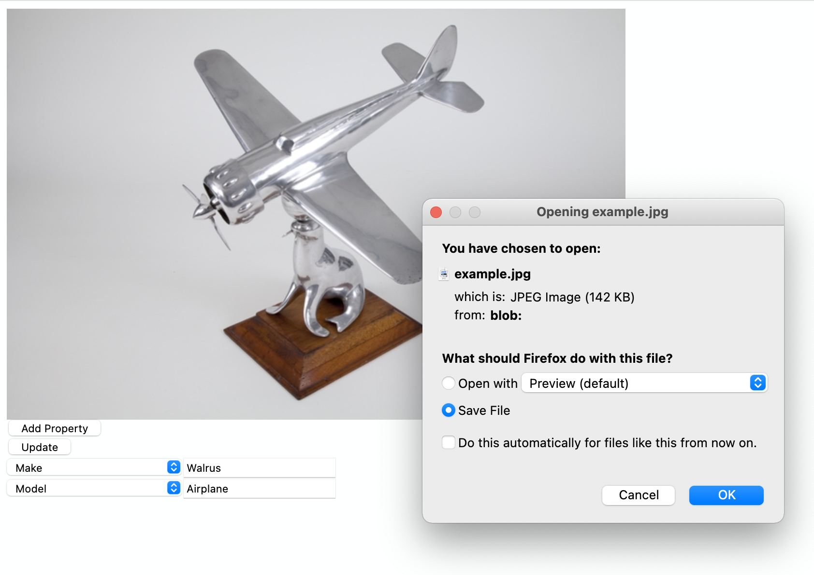

# go-exif-update

Go package to for updating EXIF data in JPEG files.

This is a thin wrapper around the dsoprea's [go-exif](https://github.com/dsoprea/go-exif) and [go-jpeg-image-structure](https://github.com/dsoprea/go-jpeg-image-structure) packages and includes command-line tools for updating the EXIF data JPEG files using key-value parameters as well as a WebAssembly (wasm) binary for updating EXIF data in JavaScript (or other languages that support wasm binaries).

The blog post [Updating EXIF metadata in JavaScript (and WebAssembly)](https://millsfield.sfomuseum.org/blog/2021/04/14/exif/) includes an example of the WebAssembly binary in action.

## Important

As of this writing the majority of EXIF tags are _not_ supported. Currently only EXIF tags of types `ASCII` and `BYTE` are supported. This is not ideal but I am still trying to get familiar with the requirements of the `go-exif` package. Contributions and patches for the other remaining EXIF tag types is welcomed.

## Documentation

[](https://pkg.go.dev/github.com/sfomuseum/go-exif-update)

### Example

```
package main

import (
	"flag"
	"github.com/sfomuseum/go-exif-update"
	"log"
	"os"
)

func main() {

	exif_props := map[string]interface{}{
		"Artist": "Bob",
		"Copyright": "SFO Museum",
	}
	
	for _, path := range paths {

		fh, _ := os.Open(path)
		defer fh.Close()

		update.UpdateExif(fh, os.Stdout, exif_props)
	}
}

```

_Error handling removed for the sake of brevity._

## Tools

```
$> make cli
GOOS=js GOARCH=wasm go build -mod vendor -o www/wasm/update_exif.wasm cmd/update-exif-wasm/main.go
GOOS=js GOARCH=wasm go build -mod vendor -o www/wasm/supported_tags.wasm cmd/tags-supported-wasm/main.go
go build -mod vendor -o bin/tags-is-supported cmd/tags-is-supported/main.go
go build -mod vendor -o bin/tags-supported cmd/tags-supported/main.go
go build -mod vendor -o bin/update-exif cmd/update-exif/main.go
go build -mod vendor -o bin/server cmd/update-exif-server/main.go
```

As part of the build process for tools the two WebAssembly (wasm) binaries that are used by the `update-exif-server` tool are compiled and placee. You can also build the wasm binaries separately using the `wasm` Makefile target:

```
$> make wasm
GOOS=js GOARCH=wasm go build -mod vendor -o www/wasm/update_exif.wasm cmd/update-exif-wasm/main.go
GOOS=js GOARCH=wasm go build -mod vendor -o www/wasm/supported_tags.wasm cmd/tags-supported-wasm/main.go
```

### tags-is-supported

Command-line tool for indicating whether a named EXIF tag is supported by the sfomuseum/go-exif-update package.

```
$> ./bin/tags-is-supported -h
Command-line tool for indicating whether a named EXIF tag is supported by the sfomuseum/go-exif-update package.

Usage:
	./bin/tags-is-supported tag(N) tag(N) tag(N)
```

For example:

```
$> ./bin/tags-is-supported Copyright ImageWidth
Copyright true
ImageWidth false
```

### tags-supported

Command-line tool that prints a list of EXIF tag names, sorted alphabetically, that are supported by the sfomuseum/go-exif-update package.

```
$> ./bin/tags-supported -h
Command-line tool that prints a list of EXIF tag names, sorted alphabetically, that are supported by the sfomuseum/go-exif-update package.

Usage:
	./bin/tags-supported
```

### update-exif

Command-line tool for updating the EXIF properties in one or more JPEG images.

```
$> ./bin/update-exif -h
Command-line tool for updating the EXIF properties in one or more JPEG images. Images are not updated in place but written to STDOUT.

Usage:
	./bin/update-exif [options] image(N) image(N) image(N)

  -property value
    	One or more {TAG}={VALUE} EXIF properties. {TAG} must be a recognized EXIF tag.
```

For example:

```
$> ./bin/update-exif \
	-property Artist=Bob \
	-property Copyright=Alice \
	test1.jpg > test2.jpg
```

And then verifying the data using the `exiv2` tool:

```
$> exiv2 -pa test2.jpg 
Exif.Image.Artist                            Ascii       4  Bob
Exif.Image.Copyright                         Ascii       6  Alice
```

### update-exif-wasm-demo

HTTP server for demonstrating the use of the update_exif WebAssembly binary.

```
$> ./bin/update-exif-wasm-demo -h
HTTP server for demonstrating the use of the update_exif WebAssembly binary.

Usage:
	 ./bin/update-exif-wasm-demo [options]
  -bootstrap-prefix string
    	A relative path to append to all Bootstrap-related paths the server will listen for requests on.
  -server-uri string
    	A valid aaronland/go-http-server URI. (default "http://localhost:8080")
```	

For example:

```
$> ./bin/update-exif-wasm-demo 
2021/04/09 17:32:21 Listening on http://localhost:8080
```

This will start a web server on `localhost:8080` hosting a small web application for updating the EXIF tags in a static image. The application is bundled with two WebAssembly binaries:

* `supported_tags.wasm` that will return a JSON-encoded list of supported EXIF tags.
* `update_exif.wasm` that will update an image encoded in a base64 data URL from a JSON-encoded dictionary of EXIF tags and values.

You should see something like this:


_It's early days so this web application lacks any kind of polish._

Once the image has been uploaded it will trigger a download prompt (using eligrey's [FileSaver.js](https://github.com/eligrey/FileSaver.js). PNG and GIF images will be re-encoded as JPEG images dynamically.



An abbreviated version of the code to use the `update_exif.wasm` binary in JavaScript looks like this:

```
    var update = { "Artist": "Bob" };	
    var enc_update = JSON.stringify(update);
    
    var img = document.getElementById("image");
    
    var canvas = document.createElement("canvas");
    canvas.width = img.width;
    canvas.height = img.height;
    var ctx = canvas.getContext("2d");
    ctx.drawImage(img, 0, 0);
    var b64_img = canvas.toDataURL("image/jpeg", 1.0);
    
    var rsp = update_exif(b64_img, enc_update);
    
    var blob = dataURLToBlob(rsp);
    saveAs(blob, "example.jpg");
```

For a complete example consult the [www/javascript/index.js](www/javascript/index.js) file.

As of this writing neither wasm binary will return any kind of useful error information if a problem is encountered. Error reporting will be logged (to the browser's console log) but in the event of an error the response value for both wasm binaries will be `null`. This is not ideal and will be addressed in future releases.

## Supported tags

The following EXIF tags are supported by this package. This list was generated by the `tags-supported` tool.

```
Artist
AsShotProfileName
BodySerialNumber
CFAPattern
CFAPlaneColor
CameraCalibrationSignature
CameraOwnerName
CameraSerialNumber
ClipPath
Copyright
DNGBackwardVersion
DNGPrivateData
DNGVersion
DateTime
DateTimeDigitized
DateTimeOriginal
DateTimeOriginal
DocumentName
DotRange
GPSAltitudeRef
GPSDateStamp
GPSDestBearingRef
GPSDestDistanceRef
GPSDestLatitudeRef
GPSDestLongitudeRef
GPSImgDirectionRef
GPSLatitudeRef
GPSLongitudeRef
GPSMapDatum
GPSMeasureMode
GPSSatellites
GPSSpeedRef
GPSStatus
GPSTrackRef
GPSVersionID
HostComputer
ImageDescription
ImageHistory
ImageID
ImageResources
ImageUniqueID
InkNames
InteroperabilityIndex
LensMake
LensModel
LensSerialNumber
LocalizedCameraModel
Make
Model
NoiseProfile
OriginalRawFileName
PreviewApplicationName
PreviewApplicationVersion
PreviewDateTime
PreviewSettingsDigest
PreviewSettingsName
ProcessingSoftware
ProfileCalibrationSignature
ProfileCopyright
ProfileHueSatMapData1
ProfileHueSatMapData2
ProfileLookTableData
ProfileName
ProfileToneCurve
RawDataUniqueID
RelatedImageFileFormat
RelatedSoundFile
SecurityClassification
Software
SpectralSensitivity
SpectralSensitivity
SubSecTime
SubSecTimeDigitized
SubSecTimeOriginal
TIFFEPStandardID
TargetPrinter
TimeZoneOffset
UniqueCameraModel
XClipPathUnits
XMLPacket
XPAuthor
XPComment
XPKeywords
XPSubject
XPTitle
YClipPathUnits
```

## See also

* https://github.com/dsoprea/go-exif
* https://github.com/dsoprea/go-jpeg-image-structure
* https://exiftool.org/TagNames/EXIF.html